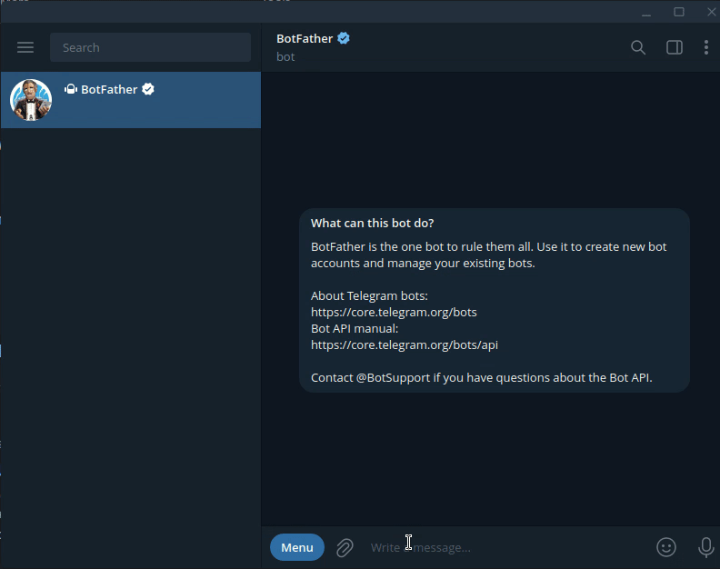

# Telegram Bot, built on Deta 🤖

Say hello to the Telegram Bot template! Built on the [grammY](https://grammy.dev/) framework and hosted by the [Deya](https://deta.sh/) serverless platform.

- Handling Inline Queries.
- Responding to commands.
- Interactive Inline Keyboards.

## Deployment

### Prerequisites

Make sure that you have the following programs installed on your own local machine.

- [Telegram Client](https://desktop.telegram.org/).

### Step 1 — Deploy on Deta 🚀

Take your new Telegram bot live with one click. \
**Free hosting. No credit card required.**

### Step 2 — Configure environment variables

1. Grab your Telegram bot's API token by sending a message to [\@BotFather](https://telegram.me/BotFather).

2. Add that Telegram-Token, Binance API-Key and Binance API-Secret to file .env and update Deta Ebvironment Variables via command 
"deta -e update .env"
